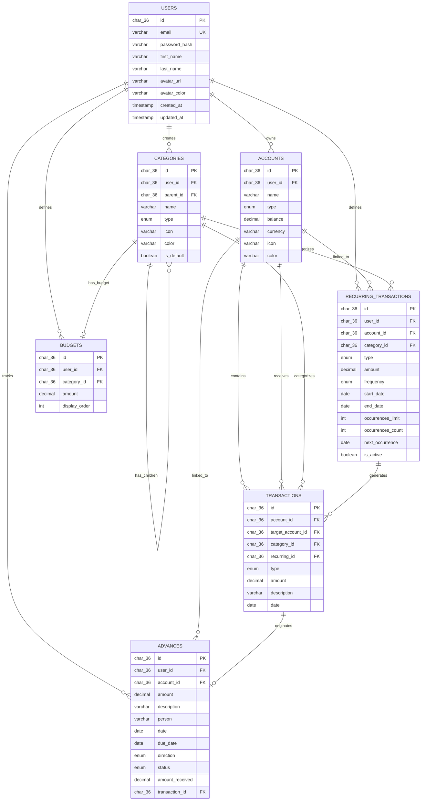

# Document de Conception

Par FREMINET Baptiste

## Périmètre

La base de données de cette application de gestion des finances personnelles inclut toutes les entités nécessaires pour suivre la situation financière d'un utilisateur. Ainsi, le périmètre de la base de données comprend :

* Les utilisateurs, incluant les informations d'identification et les identifiants d'authentification
* Les comptes bancaires, incluant le nom du compte, le type, le solde et la devise
* Les transactions, incluant les dépenses, les revenus et les virements entre comptes
* Les catégories, permettant de classifier les transactions (alimentation, transport, salaire, etc.)
* Les transactions récurrentes, représentant les opérations périodiques comme le salaire, le loyer ou les abonnements
* Les budgets mensuels, permettant de définir des plafonds de dépenses par catégorie

Sont exclus du périmètre les éléments tels que la synchronisation bancaire automatique, la conversion multi-devises, le suivi de portefeuilles d'investissement, les comptes partagés entre utilisateurs et le stockage de justificatifs.

## Exigences Fonctionnelles

Cette base de données permettra de :

* Effectuer des opérations CRUD sur les utilisateurs, comptes, catégories, transactions, transactions récurrentes et budgets
* Authentifier les utilisateurs avec un hachage sécurisé des mots de passe (bcrypt)
* Gérer plusieurs comptes bancaires par utilisateur avec différents types (courant, épargne, espèces, investissement)
* Enregistrer toutes les opérations financières avec catégorisation
* Gérer les transactions récurrentes avec diverses fréquences (quotidienne, hebdomadaire, bi-hebdomadaire, mensuelle, trimestrielle, semestrielle, annuelle)
* Gérer les paiements en plusieurs fois grâce au système de limite d'occurrences
* Définir des budgets mensuels par catégorie avec suivi des dépenses

À noter que dans cette version, le système ne permettra pas d'importer des relevés bancaires, de générer des rapports fiscaux, de partager des données entre utilisateurs, ni de recevoir des notifications automatiques.

## Représentation

Les entités sont stockées dans des tables MySQL avec le schéma suivant.

> **Note** : Ce document utilise des noms conceptuels simplifiés (users, accounts, etc.) pour la lisibilité. Dans le schéma réel (`schema.sql`), les tables utilisent le préfixe `mm_` (mm_users, mm_accounts, etc.) et les colonnes sont préfixées par l'entité (usr_, acc_, etc.) pour éviter les collisions de noms.

### Entités

La base de données comprend les entités suivantes :

#### Utilisateurs (Users)

La table `users` comprend :

* `id`, qui spécifie l'identifiant unique de l'utilisateur en tant qu'`CHAR(36)` (UUID). Cette colonne possède donc la contrainte `PRIMARY KEY`.
* `email`, qui spécifie l'adresse email de l'utilisateur en `VARCHAR(255)`. Une contrainte `UNIQUE` garantit que deux utilisateurs ne peuvent pas avoir le même email, car il sert d'identifiant de connexion.
* `password_hash`, qui stocke le mot de passe haché avec bcrypt en `VARCHAR(255)`. Stocker le hash plutôt que le mot de passe en clair est une exigence de sécurité fondamentale.
* `first_name`, qui spécifie le prénom de l'utilisateur en `VARCHAR(100)`.
* `last_name`, qui spécifie le nom de famille de l'utilisateur en `VARCHAR(100)`.
* `avatar_url`, qui stocke l'URL de l'avatar personnalisé de l'utilisateur en `VARCHAR(255)`, ou `NULL` pour utiliser l'avatar par défaut (initiales).
* `avatar_color`, qui spécifie la couleur de fond de l'avatar par défaut en `VARCHAR(7)` (code hexadécimal), avec la valeur par défaut `#6366f1`.
* `created_at`, qui est l'horodatage de création du compte, par défaut `CURRENT_TIMESTAMP`.
* `updated_at`, qui est l'horodatage de la dernière modification, mis à jour automatiquement via `ON UPDATE CURRENT_TIMESTAMP`.

Toutes les colonnes sauf les horodatages sont obligatoires et possèdent donc la contrainte `NOT NULL`.

#### Comptes Bancaires (Accounts)

La table `accounts` comprend :

* `id`, qui spécifie l'identifiant unique du compte en tant qu'`CHAR(36)` (UUID). Cette colonne possède donc la contrainte `PRIMARY KEY`.
* `user_id`, qui est l'identifiant de l'utilisateur propriétaire de ce compte en `CHAR(36)`. Cette colonne possède la contrainte `FOREIGN KEY`, référençant la colonne `id` de la table `users`.
* `name`, qui est le nom d'affichage du compte en `VARCHAR(100)` (ex: "Compte Courant BNP").
* `type`, qui spécifie le type de compte en tant qu'`ENUM` avec les valeurs : 'checking', 'savings', 'cash', 'investment', 'other'.
* `balance`, qui est le solde actuel du compte en `DECIMAL(15,2)`. Ce type a été choisi pour éviter les erreurs d'arrondi des nombres flottants, critiques dans les calculs financiers. La précision de 15 chiffres permet de gérer des montants jusqu'à des milliards avec 2 décimales.
* `currency`, qui est le code devise ISO en `VARCHAR(3)` (ex: 'EUR', 'USD').
* `icon`, qui stocke le nom de l'icône pour l'affichage en `VARCHAR(100)`.
* `color`, qui stocke le code couleur hexadécimal en `VARCHAR(7)` (ex: '#6366f1').

Le solde est stocké directement plutôt que calculé à partir des transactions pour des raisons de performance, évitant des opérations `SUM()` coûteuses sur des milliers de transactions.

#### Catégories (Categories)

La table `categories` comprend :

* `id`, qui spécifie l'identifiant unique de la catégorie en tant qu'`CHAR(36)` (UUID). Cette colonne possède donc la contrainte `PRIMARY KEY`.
* `user_id`, qui est l'identifiant de l'utilisateur ayant créé cette catégorie en `CHAR(36)`, ou `NULL` pour les catégories par défaut. Cette colonne possède la contrainte `FOREIGN KEY`, référençant la colonne `id` de la table `users`.
* `parent_id`, qui est l'identifiant de la catégorie parente en `CHAR(36)`, ou `NULL` pour les catégories racines. Cette colonne possède la contrainte `FOREIGN KEY` auto-référencée vers la même table.
* `name`, qui est le nom de la catégorie en `VARCHAR(100)` (ex: "Alimentation", "Transport").
* `type`, qui spécifie si cette catégorie est pour les revenus ('income') ou les dépenses ('expense') en tant qu'`ENUM`.
* `icon`, qui stocke le nom de l'icône en `VARCHAR(100)`.
* `color`, qui stocke le code couleur hexadécimal en `VARCHAR(7)`.
* `is_default`, qui est un `BOOLEAN` indiquant si c'est une catégorie fournie par le système.

La colonne `user_id` nullable permet de distinguer les catégories par défaut (partagées par tous les utilisateurs) des catégories personnalisées créées par un utilisateur spécifique.

La colonne `parent_id` permet de créer des hiérarchies de catégories (ex: "Alimentation > Restaurants > Fast-food"). Les budgets définis sur une catégorie parente agrègent automatiquement les dépenses de toutes ses sous-catégories.

#### Transactions

La table `transactions` comprend :

* `id`, qui spécifie l'identifiant unique de la transaction en tant qu'`CHAR(36)` (UUID). Cette colonne possède donc la contrainte `PRIMARY KEY`.
* `account_id`, qui est l'identifiant du compte source en `CHAR(36)`. Cette colonne possède la contrainte `FOREIGN KEY`, référençant la colonne `id` de la table `accounts`.
* `target_account_id`, qui est l'identifiant du compte destination pour les virements en `CHAR(36)`, ou `NULL` pour les transactions non-virement. Cette colonne possède la contrainte `FOREIGN KEY`.
* `category_id`, qui est l'identifiant de la catégorie de la transaction en `CHAR(36)`. Cette colonne possède la contrainte `FOREIGN KEY`, référençant la colonne `id` de la table `categories`.
* `recurring_id`, qui lie à la transaction récurrente source si applicable, ou `NULL` sinon.
* `type`, qui spécifie le type de transaction en tant qu'`ENUM` avec les valeurs : 'income', 'expense', 'transfer'.
* `amount`, qui est le montant de la transaction en `DECIMAL(15,2)`.
* `description`, qui est une description libre en `VARCHAR(255)`.
* `date`, qui est la date de la transaction en `DATE`.

La colonne `target_account_id` permet de gérer les virements entre comptes de manière atomique, évitant la duplication de données qui pourrait créer des incohérences.

#### Transactions Récurrentes (Recurring Transactions)

La table `recurring_transactions` comprend :

* `id`, qui spécifie l'identifiant unique en tant qu'`CHAR(36)` (UUID). Cette colonne possède donc la contrainte `PRIMARY KEY`.
* `user_id`, qui est l'identifiant du propriétaire en `CHAR(36)`. Cette colonne possède la contrainte `FOREIGN KEY`.
* `account_id`, qui est l'identifiant du compte associé en `CHAR(36)`. Cette colonne possède la contrainte `FOREIGN KEY`.
* `category_id`, qui est l'identifiant de la catégorie en `CHAR(36)`. Cette colonne possède la contrainte `FOREIGN KEY`.
* `type`, qui spécifie 'income' ou 'expense' en tant qu'`ENUM`.
* `amount`, qui est le montant récurrent en `DECIMAL(15,2)`.
* `description`, qui est une description libre en `VARCHAR(255)`.
* `frequency`, qui spécifie la fréquence de récurrence en tant qu'`ENUM` avec les valeurs : 'daily', 'weekly', 'biweekly', 'monthly', 'quarterly', 'semi_annual', 'annual'.
* `start_date`, qui est la date de début en `DATE`.
* `end_date`, qui est une date de fin optionnelle en `DATE`, ou `NULL` pour une récurrence indéfinie.
* `occurrences_limit`, qui est le nombre maximum d'occurrences en `INT`, ou `NULL` pour illimité.
* `occurrences_count`, qui suit le nombre d'occurrences déjà générées en `INT`, par défaut 0.
* `next_occurrence`, qui est la prochaine date prévue en `DATE`.
* `is_active`, qui est un `BOOLEAN` indiquant si la récurrence est active.

Le système d'occurrences permet de gérer à la fois les transactions indéfinies (salaire mensuel) et les paiements en plusieurs fois (paiement en 4x) avec la même structure.

#### Budgets

La table `budgets` comprend :

* `id`, qui spécifie l'identifiant unique en tant qu'`CHAR(36)` (UUID). Cette colonne possède donc la contrainte `PRIMARY KEY`.
* `user_id`, qui est l'identifiant de l'utilisateur propriétaire en `CHAR(36)`. Cette colonne possède la contrainte `FOREIGN KEY`, référençant la colonne `id` de la table `users`.
* `category_id`, qui est l'identifiant de la catégorie concernée en `CHAR(36)`. Cette colonne possède la contrainte `FOREIGN KEY`, référençant la colonne `id` de la table `categories`.
* `amount`, qui est le plafond mensuel de dépenses en `DECIMAL(15,2)`.
* `display_order`, qui est un `INT` optionnel définissant l'ordre d'affichage sur le tableau de bord, ou `NULL` si non affiché en priorité.

Une contrainte `UNIQUE` sur le couple `(user_id, category_id)` garantit qu'un utilisateur ne peut avoir qu'un seul budget par catégorie.

#### Avances (Advances)

La table `advances` comprend :

* `id`, qui spécifie l'identifiant unique de l'avance en tant qu'`CHAR(36)` (UUID). Cette colonne possède donc la contrainte `PRIMARY KEY`.
* `user_id`, qui est l'identifiant de l'utilisateur propriétaire en `CHAR(36)`. Cette colonne possède la contrainte `FOREIGN KEY`, référençant la colonne `id` de la table `users`.
* `account_id`, qui est l'identifiant du compte bancaire associé en `CHAR(36)`. Cette colonne possède la contrainte `FOREIGN KEY`, référençant la colonne `id` de la table `accounts`.
* `amount`, qui est le montant de l'avance en `DECIMAL(15,2)`.
* `description`, qui est une description optionnelle en `VARCHAR(255)`.
* `person`, qui est le nom de la personne concernée (prêteur ou emprunteur) en `VARCHAR(100)`.
* `date`, qui est la date de l'avance en `DATE`.
* `due_date`, qui est la date d'échéance prévue pour le remboursement en `DATE`, ou `NULL` si aucune échéance n'est fixée.
* `direction`, qui spécifie le sens de l'avance en tant qu'`ENUM` avec les valeurs : 'given' (j'ai prêté de l'argent, en attente de remboursement) ou 'received' (on m'a prêté, je dois rembourser).
* `status`, qui spécifie l'état du remboursement en tant qu'`ENUM` avec les valeurs : 'pending' (aucun remboursement reçu), 'partial' (partiellement remboursé), 'paid' (entièrement remboursé).
* `amount_received`, qui est le montant déjà remboursé en `DECIMAL(15,2)`, par défaut 0.
* `transaction_id`, qui est l'identifiant de la transaction initiale générée automatiquement lors de la création de l'avance en `CHAR(36)`, ou `NULL`. Cette colonne possède la contrainte `FOREIGN KEY`, référençant la colonne `id` de la table `transactions`.

La colonne `direction` permet de distinguer deux cas d'usage : le suivi des sommes prêtées à des tiers (à recevoir) et le suivi des sommes empruntées (à rembourser). Le statut est mis à jour automatiquement lors de l'enregistrement des remboursements partiels ou totaux.

### Relations

Le diagramme entité-relation ci-dessous décrit les relations entre les entités de la base de données.



Comme détaillé par le diagramme :

* Un utilisateur peut posséder 0 à plusieurs comptes. 0 s'il vient de s'inscrire et n'a pas encore créé de compte, et plusieurs s'il a plusieurs comptes bancaires. Un compte appartient à un et un seul utilisateur.
* Un utilisateur peut créer 0 à plusieurs catégories personnalisées. Les catégories par défaut ont un `user_id` à `NULL` et sont partagées par tous les utilisateurs.
* Un compte peut contenir 0 à plusieurs transactions. Une transaction appartient à un et un seul compte source. Pour les virements, une transaction référence également un compte destination.
* Une catégorie peut être associée à 0 à plusieurs transactions : 0 si aucune transaction n'a été assignée à cette catégorie, et plusieurs si plusieurs transactions partagent la même catégorie. Une transaction a une et une seule catégorie (ou aucune si non catégorisée).
* Une transaction récurrente peut générer 0 à plusieurs transactions réelles : 0 si la récurrence vient d'être créée, et plusieurs au fur et à mesure que les occurrences sont générées. Une transaction générée peut optionnellement référencer sa transaction récurrente source.
* Un utilisateur peut définir 0 à plusieurs budgets. Un budget appartient à un et un seul utilisateur.
* Une catégorie peut avoir 0 ou 1 budget associé par utilisateur. Un budget est toujours lié à une et une seule catégorie.
* Un utilisateur peut créer 0 à plusieurs avances. Une avance appartient à un et un seul utilisateur et est liée à un compte bancaire. Une avance peut optionnellement référencer la transaction générée automatiquement lors de sa création.

Les suppressions sont gérées en cascade : supprimer un utilisateur supprime automatiquement tous ses comptes, transactions, budgets et avances via les contraintes `ON DELETE CASCADE`.

## Optimisations

Conformément aux requêtes typiques dans `queries.sql`, il est courant pour les utilisateurs de la base de données d'accéder aux données filtrées par des critères spécifiques. Pour cette raison, des index sont créés sur les colonnes suivantes :

* `users.email` : Accélère la recherche d'utilisateur lors de l'authentification
* `accounts.user_id` : Accélère la récupération de tous les comptes d'un utilisateur
* `categories.user_id` et `categories.type` : Accélère le filtrage des catégories par propriétaire et par type
* `transactions.account_id` : Accélère la récupération de toutes les transactions d'un compte
* `transactions.target_account_id` : Accélère la recherche des virements reçus
* `transactions.date` : Accélère le filtrage et le tri par date
* `transactions.type` : Accélère le filtrage par type de transaction
* `recurring_transactions.next_occurrence` : Accélère l'identification des transactions à générer
* `recurring_transactions.is_active` : Accélère le filtrage des récurrences actives
* `budgets.user_id` : Accélère la récupération de tous les budgets d'un utilisateur
* `budgets.display_order` : Accélère le tri par ordre d'affichage sur le tableau de bord
* `advances.user_id` : Accélère la récupération de toutes les avances d'un utilisateur
* `advances.direction` : Accélère le filtrage par direction (prêts donnés ou reçus)
* `advances.status` : Accélère le filtrage par statut de remboursement
* `advances.person` : Accélère la recherche et le regroupement par personne
* `advances.date` : Accélère le tri et le filtrage par date

## Limitations

Le schéma actuel présente les limitations suivantes :

* **Pas de support multi-devises** : Les transactions entre comptes de devises différentes ne sont pas automatiquement converties. Les utilisateurs doivent gérer manuellement les conversions.
* **Soldes potentiellement désynchronisés** : Comme les soldes sont stockés plutôt que calculés, une erreur applicative pourrait créer des incohérences entre le solde affiché et la somme des transactions.
* **Pas de piste d'audit** : Les modifications de transactions ne sont pas journalisées. Les suppressions ou modifications accidentelles ne peuvent pas être retracées.
* **Une seule catégorie par transaction** : Une transaction ne peut avoir qu'une seule catégorie, sans support pour des tags multiples.

---

## Architecture Frontend

L'application frontend suit une architecture modulaire React avec séparation des responsabilités.

### Stack Technique

| Technologie | Rôle |
|-------------|------|
| React 19 | Framework UI |
| Vite | Build tool et dev server |
| Tailwind CSS | Styling utilitaire |
| MUI | Composants Material Design |
| React Select | Sélecteurs avancés |
| Vitest | Tests unitaires |

### Organisation des Composants

L'architecture suit le pattern de composition avec une hiérarchie claire :

```
components/
├── ui/                  # Composants atomiques réutilisables
├── forms/               # Formulaires CRUD complets
├── budgets/             # Composants spécifiques à la page Budgets
└── layout/              # Composants de structure de page
```

#### Composants UI (20 composants)

Composants atomiques et réutilisables, chacun dans son propre dossier avec un barrel export :

| Catégorie | Composants |
|-----------|------------|
| **Affichage** | `AmountDisplay`, `CategoryBadge`, `EmptyState`, `ProgressBar`, `BudgetProgressBar` |
| **Cartes** | `AccountCard`, `BudgetCard`, `RecurringCard`, `TransactionRow`, `ChartCard` |
| **Formulaires** | `FormInput`, `CurrencyInput`, `DatePicker`, `SearchInput`, `ColorPicker`, `TypeSelector` |
| **Modales** | `Modal`, `FormModal`, `ConfirmModal` |
| **Actions** | `ActionButton` (variantes: default, danger, success, warning, ghost) |

#### Formulaires (5 formulaires)

Formulaires CRUD complets avec validation et gestion d'état :

| Formulaire | Fonctionnalités |
|------------|-----------------|
| `TransactionForm` | Création/édition, sélection compte/catégorie, gestion des virements |
| `BudgetForm` | Hiérarchie catégories, agrégation sous-catégories |
| `AccountForm` | Types de compte, icône et couleur personnalisables |
| `CategoryForm` | Catégories hiérarchiques (parent/enfant), icône et couleur |
| `RecurringForm` | Fréquences multiples, limite d'occurrences, date de fin |

#### Composants Budgets

La page Budgets, la plus complexe de l'application (~1200 lignes initialement), a été scindée en 3 composants :

| Composant | Responsabilité | Lignes |
|-----------|----------------|--------|
| `BudgetsSidebar` | Navigation et liste des budgets | ~150 |
| `BudgetsContent` | Affichage détaillé, transactions, graphiques | ~460 |
| `BudgetsModals` | Modales de création/édition/suppression | ~425 |

### Hooks Personnalisés

| Hook | Usage |
|------|-------|
| `useModalState` | Gestion standardisée des états de modales avec `{ isOpen, data, open(entity), close() }` |

Ce hook est utilisé dans toutes les pages pour gérer les 14+ modales de l'application de manière cohérente.

### Utilitaires Centralisés

#### `formatters.js`

```javascript
formatCurrency(amount)     // 1234.56 → "1 234,56 €"
formatDate(date)           // "2025-01-15" → "15 janvier 2025"
formatDateShort(date)      // "2025-01-15" → "15 jan."
```

#### `constants.js`

```javascript
// Enums
TRANSACTION_TYPES = { EXPENSE: 'expense', INCOME: 'income', TRANSFER: 'transfer' }
ACCOUNT_TYPES = { CHECKING: 'checking', SAVINGS: 'savings', CASH: 'cash', ... }
FREQUENCIES = { DAILY: 'daily', WEEKLY: 'weekly', MONTHLY: 'monthly', ... }

// Labels pour affichage
ACCOUNT_TYPE_LABELS = { checking: 'Compte courant', savings: 'Épargne', ... }
FREQUENCY_LABELS = { daily: 'Quotidien', weekly: 'Hebdo', monthly: 'Mensuel', ... }
```

### Optimisations Performance

#### useMemo

Mémorisation des calculs coûteux :

* `Budgets.jsx` : Construction des hiérarchies de catégories, tri des options, agrégation des transactions enfants
* `Transactions.jsx` : Groupement par mois, filtrage, tri
* `Dashboard.jsx` : Calcul des budgets à afficher

#### useCallback

Mémorisation des handlers pour éviter les re-renders :

* Ouverture/fermeture des modales
* Handlers de formulaires
* Fonctions de toggle (accordéons, filtres)

### Tests

24 tests unitaires Vitest couvrent les utilitaires :

* `formatters.test.js` : Tests des fonctions de formatage (montants, dates, cas limites)
* `constants.test.js` : Tests de cohérence des enums et labels

### Diagramme des Dépendances

```
Pages
├── Dashboard.jsx
│   ├── components/ui (ChartCard, BudgetProgressBar, AmountDisplay)
│   └── utils (formatters, constants)
├── Transactions.jsx
│   ├── components/ui (TransactionRow, SearchInput, EmptyState)
│   ├── components/forms (TransactionForm)
│   └── hooks (useModalState)
├── Budgets.jsx
│   ├── components/budgets (Sidebar, Content, Modals)
│   ├── components/forms (BudgetForm)
│   └── hooks (useModalState)
├── Comptes.jsx
│   ├── components/ui (AccountCard, EmptyState)
│   ├── components/forms (AccountForm)
│   └── hooks (useModalState)
├── Categories.jsx
│   ├── components/ui (CategoryBadge, EmptyState)
│   ├── components/forms (CategoryForm)
│   └── hooks (useModalState)
└── Parametres.jsx
    └── components/layout (PageHeader)
```
